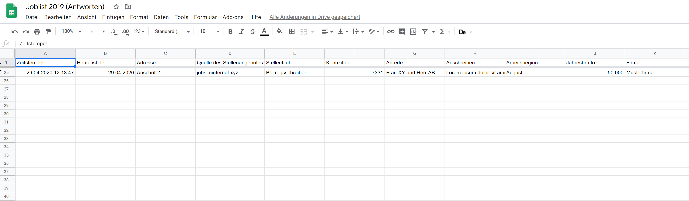
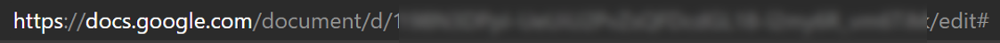
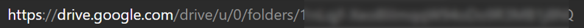
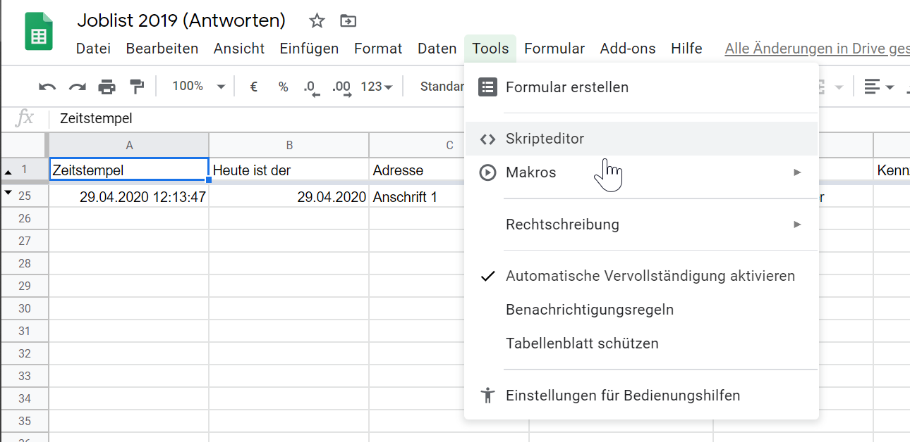
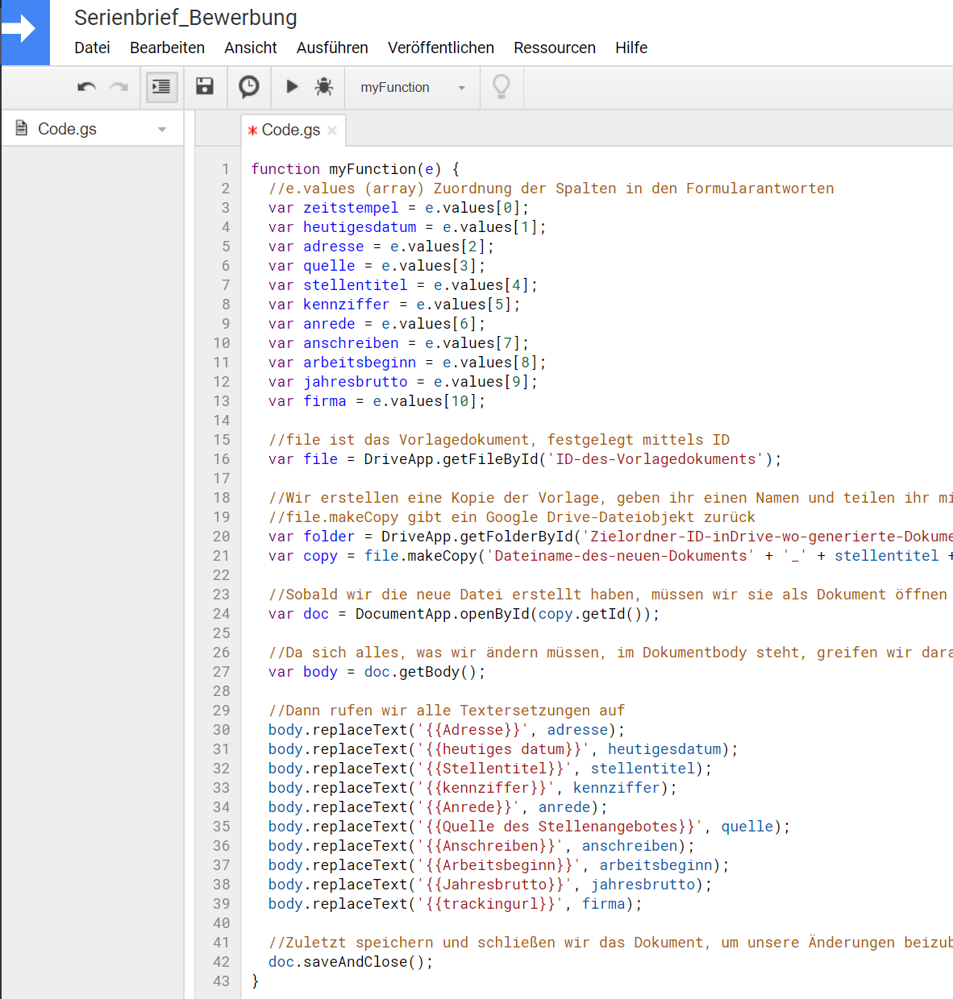
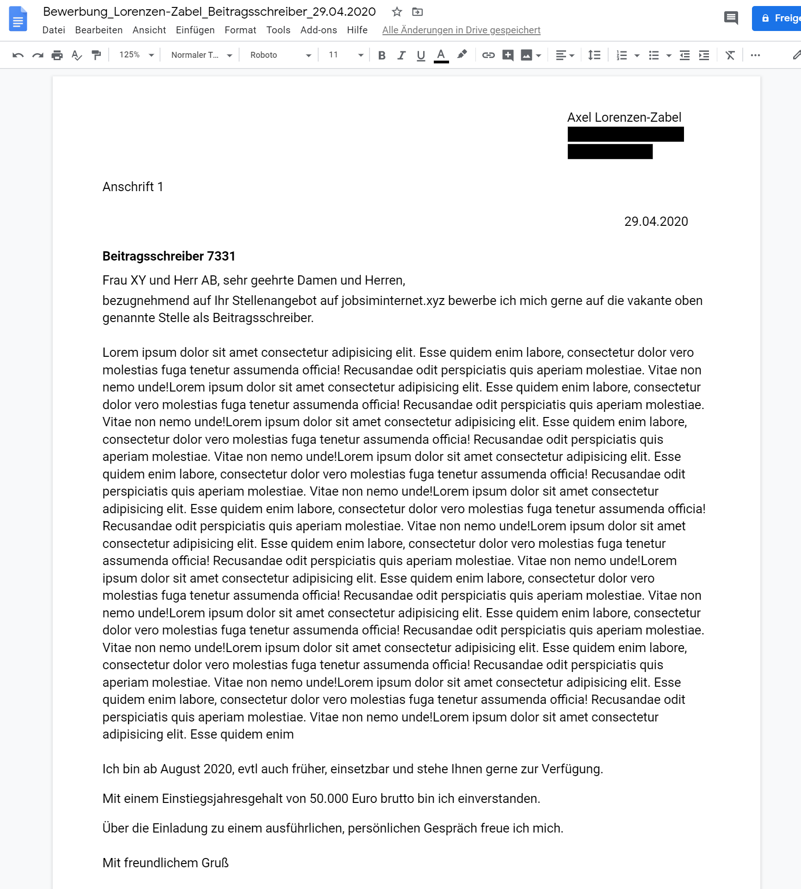
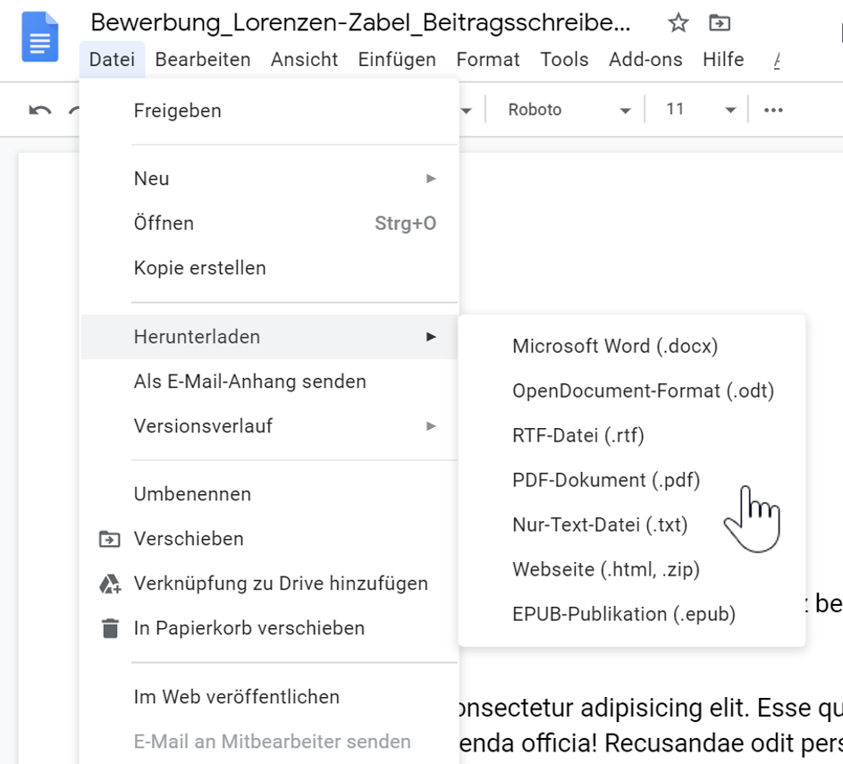

Auf meiner letzten Jobsuche konnte ich einige Erfahrungen sammeln, die ich hier festhalten möchte. Eventuell helfen meine Erfahrungen anderen, die sich in vergleichbarer Situation befinden.

Zur Ausgangslage:

Meine aktuelle Projektstelle läuft planmäßig aus, daher habe ich mich im Dezember ($ t_{ 0 } $) mal über offene Stellen informiert. Mit einem Rundumschlag auf gängigen Jobaggregatoren- und Seiten, die die Geo*- und IT-Zielgruppe bedienen wie beispielsweise [digital-geography.com](https://de.digital-geography.com/jobs/ "digital-geography.com") oder [greenjobs.de](https://www.greenjobs.de/ "greenjobs.de") habe ich angefangen.


Dieser war schon sehr ergiebig. Ergänzend habe ich die handverlesenen Angebote von [gesinesjobtipps.de](https://gesinesjobtipps.de/ "gesinesjobtipps.de") gescannt sowie die Suchfunktion für Stellenangebote von Google durchforstet.


## Automatisierung der Erstellung von Bewerbungsunterlagen.

($ t_{ 1 } $) Für die Zusammenführung meiner Bewerbungsunterlagen habe ich die Serienbrief Funktionen von Google Documents, Google Forms und Google Sheets verwendet.


### Vorbereitung der Dokumente

Zuallererst habe ich ein leeres Dokument erstellt und die feststehenden Eintragung vorgenommen. Diese entsprechen denen eines Standardbriefes (eigene Anschrift, Begrüßung, Verabschiedung, Unterschrift).


Die weiteren Unterlagen wie Lebenslauf, Zeugnisse und Beurteilungen werden ebenfalls in das Dokument eingefügt. So ist das Grundgerüst fertig.

Nun fügen wir in das Anschreiben Platzhalter ein. Diese sind in dem Format `{{$Spaltenname}}` einzusetzen. Die Variablen entsprechen denen der Antwortentabelle. Ich habe folgende Variablen in meinem Formular verwendet:

```
{{Adresse}}
{{heutiges datum}}  

{{Stellentitel}} {{kennziffer}}

{{Anrede}}
{{Quelle des Stellenangebotes}}{{Stellentitel}}.

{{Anschreiben}}

{{Arbeitsbeginn}} {{Jahr}}
```

Im folgenden Bild sind die Platzhaltervariablen im Dokumententext zu sehen:


### Formular erstellen

erstellen wir nun ein neues Formular.


Die Antworten auf die Fragen stellen wir auf das gewünschten Format um. Hier beispielsweise richten wir ein Datumsfeld ein. Die Verwendeten Fragentitel definieren die Platzhalter-Variablen


Weiter erstellen wir für jede Platzhaltervariable eine Frage.

### Tabelle mit Antworten prüfen



### Vorbereitung der Zusammenführung

Für die Verknüpfung der Formulardaten und dem Dokument benötigen wir die ID des Vorlagedokuments (das mit den Platzhaltern) sowie eine ID für den Ablageort der neu erstellten Dokumente.

* `ID des Vorlagedokuments` 
* `ID des Verzeichnisses` 

### Skript zur Zusammenführung

Für die Zusammenführung öffen wir die Antwortentabelle und öffnen dort unter `Menü -> Skripteditor` den selbigen.



Dort kopieren wir folgendes Skript hinein:

    function myFunction(e) {
      //e.values (array) Zuordnung der Spalten in den Formularantworten
      var zeitstempel = e.values[0];
      var heutigesdatum = e.values[1];
      var adresse = e.values[2];
      var quelle = e.values[3];
      var stellentitel = e.values[4];
      var kennziffer = e.values[5];
      var anrede = e.values[6];
      var anschreiben = e.values[7];
      var arbeitsbeginn = e.values[8];                     
      var jahresbrutto = e.values[9];
      var firma = e.values[10];
                            
      //file ist das Vorlagedokument, festgelegt mittels ID
      var file = DriveApp.getFileById('ID-des-Vorlagedokuments'); 
      
      //Wir erstellen eine Kopie der Vorlage, geben ihr einen Namen und teilen ihr mit, in welchem Ordner sie kopiert werden soll
      //file.makeCopy gibt ein Google Drive-Dateiobjekt zurück
      var folder = DriveApp.getFolderById('Zielordner-ID-inDrive-wo-generierte-Dokumente-abgelegt-werden-sollen')
      var copy = file.makeCopy('Dateiname-des-neuen-Dokuments' + '_' + stellentitel + '_' + heutigesdatum, folder); 
      
      //Sobald wir die neue Datei erstellt haben, müssen wir sie als Dokument öffnen mittels ihrer ID
      var doc = DocumentApp.openById(copy.getId()); 
      
      //Da sich alles, was wir ändern müssen, im Dokumentbody steht, greifen wir darauf zu
      var body = doc.getBody(); 
      
      //Dann rufen wir alle Textersetzungen auf
      body.replaceText('{{Adresse}}', adresse); 
      body.replaceText('{{heutiges datum}}', heutigesdatum); 
      body.replaceText('{{Stellentitel}}', stellentitel);  
      body.replaceText('{{kennziffer}}', kennziffer); 
      body.replaceText('{{Anrede}}', anrede); 
      body.replaceText('{{Quelle des Stellenangebotes}}', quelle); 
      body.replaceText('{{Anschreiben}}', anschreiben); 
      body.replaceText('{{Arbeitsbeginn}}', arbeitsbeginn); 
      body.replaceText('{{Jahresbrutto}}', jahresbrutto); 
      body.replaceText('{{trackingurl}}', firma);
      
      //Zuletzt speichern und schließen wir das Dokument, um unsere Änderungen beizubehalten
      doc.saveAndClose(); 
    }

Das sollte dann so aussehen:


### Probieren wir es aus
Öffnen wir die Vorschau für das Formular und tragen in jedes Feld etwas ein und senden es ab.

## Prüfung und Export als pdf

Jetzt befindet sich ein neues Dokument im festgelegten Ordner. Für jeden neuen Formulareintrag, wird ein neues Dokument erstellt und entsprechend der Formulareingaben benannt. So ist es einfach und schnell mehrere Bewerbungen vorzubereiten.




Für den Versand besteht auch die Möglichkeit der Automatisierung. Für uns reicht heute aber der Download des Dokuments als PDF.


Die Automatisierung habe ich genutzt um mir einen Arbeitsschritt leichter zu machen. Die sorgfältige Bearbeitung und passgenauigkeit Ihrer Bewerbungsunterlagen sollten Sie dennoch stets beachten, also:
# Setzen Sie auf Klasse statt Masse!


## To-Do
Gedankenstütze und weitere Möglichkeiten dieser Automatisierung:

* [x] Zusammenstellung der Vorlage
* [x] Formularbasierte Dokumentenerstellung
* [ ] Automatische PDF Generierung
* [ ] Rechtschreibprüfung und automatisierter Versand